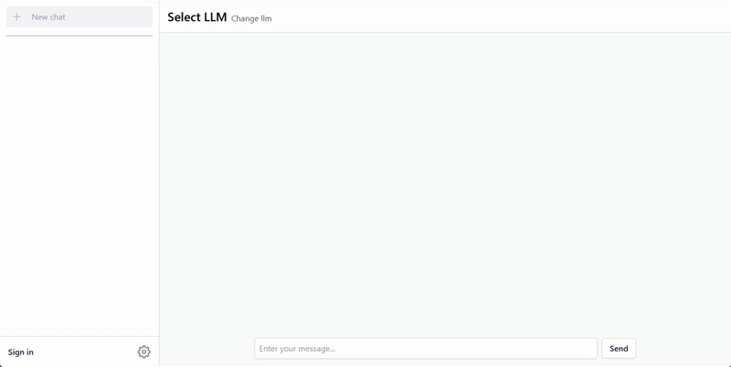

# Talk to Ai

Talk to Ai is a web application designed to facilitate chatting with various LLMs. Currently, the application supports integration with Ollama, enabling users to add, remove, and interact with different models through a user-friendly interface. Built with Laravel and Vue.

## Features

- **Multi-Model Chat Interface**  
  Interact with neural networks such as Ollama. Future updates may extend support to additional models.

- **Flexible Model Management**  
  Easily add or remove models in the Ollama integration via the LLMs section.

- **Customizable Server Settings**  
  Specify the server address for your Ollama installation (default for local installations: `localhost:11434`).

- **Dockerized Deployment**  
  Everything is containerized with Docker for consistent setup and deployment.

## Installation & Deployment

Follow these steps to deploy Talk to Ai:

1. **Clone the Repository**

   ```bash
   git clone https://github.com/lewenbraun/talk-to-ai.git
   cd talk-to-ai
   ```

2. **Configure Environment**

   - Copy the sample environment file:

     ```bash
     cp .env.example .env
     ```

   - Update your `.env` file if necessary.

3. **Start Docker Containers**

   Launch the application using Docker Compose:

   ```bash
   docker-compose up -d
   ```

4. **Generate Application Key**

   Generate the Laravel application key:

   ```bash
   docker-compose exec tta-backend php artisan key:generate
   ```

5. **Run Migrations**

   Initialize the database schema with:

   ```bash
   docker-compose exec tta-backend php artisan migrate
   ```

## Usage

### Setup

Go to the settings page to specify the Ollama server address (if the app and ollama are deployed locally: `localhost:11434`), then go to the "LLMs" section to update the models.



### Chatting

After completing the setup, begin chatting with LLM through the chat interface.


## Technologies Used

- **Laravel:** For the backend.
- **Vue:** For the frontend embedded in Laravel.
- **Tailwind:** For rapid frontend development.
- **Docker:** Containerizes the application for consistent deployment across environments.
- **Supervisor:** Manages the web server, queue workers, and Reverb server processes.
- **Laravel Reverb:** For WebSockets.
- **Redis:** For Laravel Queues.

## Contributing

Contributions, issues, and feature requests are welcome. Please check the issues page for more details.

## License

This project is licensed under the MIT License.
